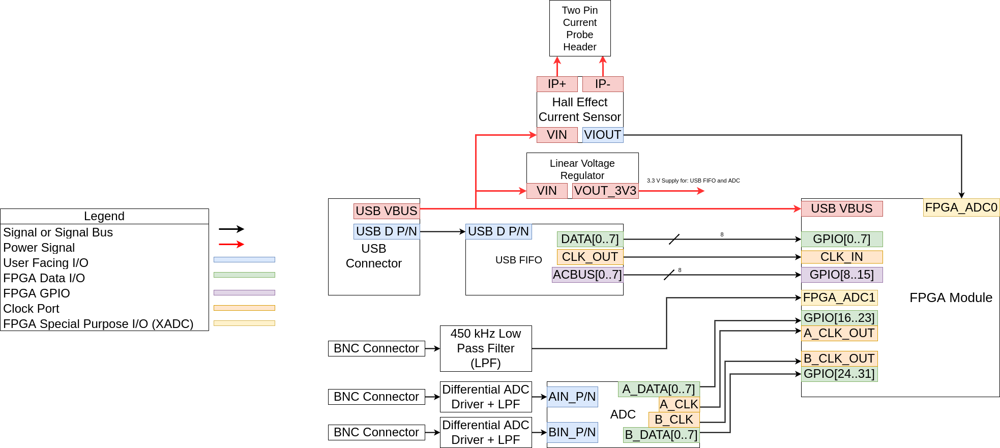

# TeachEE
This monolithic repository contains all software, RTL, hardware designs, and
reports for the TeachEE oscilloscope capstone project.

Each subdirectory of this repository contains a README explaining its contents.
The repository primarily consists of the software, hardware and rtl
subdirectories. These folders contain the Rust desktop app code, PCB design, and
SystemVerilog code respectively. In addition to these directories, there are also dedicated folders for our reports and miscellaneous files.

# Authors
- [Eric Yang](https://github.com/EYangster)
- [John Giorshev](https://github.com/jagprog5)
- [Timothy Morland](https://github.com/thetimmorland)
- [Ethan Peterson](https://github.com/ethanmpeterson)

# System Block Diagram

# PCB Design
The full design has been uploaded to Altium's online viewer. Click [here](https://365.altium.com/files/0E0F9283-7CE6-4F7A-A1F5-A4D0804C79EE) for
full schematics, layout, and bill of materials.

